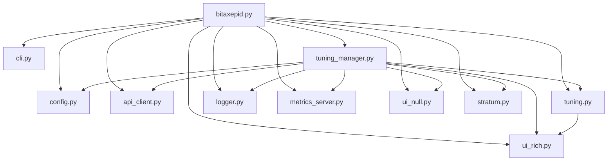

# BitaxePID Auto-Tuner


## Overview

BitaxePID is an auto-tuning utility for Bitaxe open-source Bitcoin ASIC miners
(BM1366, BM1368, BM1370 and BM1397). It optimizes miner performance by
dynamically adjusting core voltage and frequency to hit a target hashrate while
keeping temperature and power within limits. It uses dual PID controllers (via
`simple-pid`) and provides a cyberpunk-themed TUI for real-time monitoring.
Tuning data is logged to CSV and persisted to a JSON snapshot so a restart
resumes where the previous run left off.

### Note

Upgrades may require updates to all files. You should either download the FULL
release for a version, or clone the main repo.


---

### Intent

- **Performance optimization**: adjusts voltage and frequency within the limits
  declared in the chip's YAML file to meet a user-defined hashrate setpoint
  using PID control.
- **Thermal and power management**: safety comes before the hashrate target. If
  temperature exceeds `TARGET_TEMP` or power exceeds `POWER_LIMIT * 1.075`, the
  tuner lowers settings even though that means missing the setpoint.
- **Stability**: persists settings across runs with a snapshot file and resets
  the PID controllers on stagnation.
- **Non-intrusive by default**: BitaxePID does not touch the miner's stratum
  pool configuration unless you explicitly allow it. See
  [Pool management](#pool-management).
- **User experience**: a rich TUI with ANSI-art hashrate display, system stats,
  progress bars and a scrolling log, alongside file-based logging.

### Hardware context

The Bitaxe family (values below for the Ultra/Supra class boards):

- BM1366 ASIC: 0.021 J/GH efficiency.
- Power: 5V DC, 15W max, via TI TPS40305 buck regulator and Maxim DS4432U+ DAC.
- Control: ESP32-S3-WROOM-1 for WiFi/API, with INA260 power meter and EMC2101
  for fan/temperature monitoring.
- Cooling: requires a 40x40mm fan.

## Features

- **Model-specific configuration**: one YAML per ASIC model, plus an optional
  user YAML that overrides individual keys via `--config`.
- **PID control**: two controllers, one for frequency and one for voltage, with
  gains defined per model in the YAML file.
- **Safety constraints**: respects the power limit and the voltage/frequency
  bounds of the configured chip.
- **Snapshot persistence**: saves settings to `bitaxepid_snapshot_<model>.json`.
- **TUI display**: cyberpunk-style interface with ANSI-art GH/s, system stats,
  progress bars and a scrolling log. `--log-to-console` disables it.
- **Logging**: `bitaxepid_monitor.log` plus a CSV tuning log.
- **Optional metrics endpoint**: JSON over HTTP on port 8093, enabled with
  `--serve-metrics`. Note it serves plain JSON, not the Prometheus text
  exposition format, so Prometheus cannot scrape it directly; it is useful as-is
  for a browser, `curl`, or anything that reads JSON.

## Installation

Requires **Python 3.9 or newer** (the code uses builtin generics such as
`tuple[str, int]`).

Install the dependencies declared in `requirements.txt`:

```bash
pip install -r requirements.txt
```

Or create a virtual environment with [uv](https://docs.astral.sh/uv/getting-started/installation/):

```bash
bash scripts/setup.sh
```

The scripts under `scripts/` can be run from any directory; they resolve paths
relative to the repository root.

## Containers

### docker compose

The easiest way to leave the tuner running on a machine that is already on all
the time (an Umbrel node, a Raspberry Pi, a NAS):

```bash
cp .env.example .env      # put your miner IP in BITAXEPID_MINER_IP
docker compose up -d --build
docker compose logs -f
```

[UMBREL.md](UMBREL.md) walks through this on an Umbrel node step by step, in
Spanish: what the startup log should look like, how to check the limits are
actually in place, and what is verified and what is not.

`docker compose down` stops it. The default profile is `safe-BM1370.yaml`
(conservative limits, see below); change `BITAXEPID_CONFIG` in `.env` for a
different one, or unset it to use the factory limits of whichever chip the miner
reports.

The tuning CSV and the snapshot are written to `./data`, which is mounted into
the container, so they survive `docker compose down`. Metrics are published on
the host port set by `BITAXEPID_METRICS_PORT` (8093 by default).

The container talks to the miner over HTTP on the LAN through the default bridge
network: it needs no extra privileges and no host networking. It also means it
cannot discover the miner by mDNS, so give the miner a fixed address — a DHCP
reservation in your router is enough.

### podman

```bash
podman build --tag bitaxepid-container .
podman run -it --publish 8093:8093 bitaxepid-container 192.168.68.111
```

Extra flags are passed through to the tuner, so
`podman run ... bitaxepid-container 192.168.68.111 --manage-pools` works.

## Safe limits

`MIN_VOLTAGE`, `MAX_VOLTAGE`, `MIN_FREQUENCY` and `MAX_FREQUENCY` are hard
limits: no value outside that range is ever sent to the miner. Both paths that
write to the hardware are clamped — the initial value (in `validate_config`,
after the command-line overrides are applied) and every proposal from the tuning
strategy (at the end of `apply_strategy`). A clamped initial value is logged as
a warning rather than being applied silently.

`TARGET_TEMP` is not a limit but a setpoint: above it, the tuner lowers
frequency first and then voltage, one step per sample.

`safe-BM1370.yaml` is a conservative profile for the Bitaxe Gamma, meant to be
passed with `--config` on top of `BM1370.yaml`:

```bash
python bitaxepid.py --ip 192.168.68.111 --config safe-BM1370.yaml
```

It caps frequency at 500 MHz (factory 625) and voltage at 1150 mV (factory
1250), targets 55 °C, and lowers `HASHRATE_SETPOINT` to something reachable
within those caps — an unreachable setpoint keeps the PID asking for more
forever and pins it against the voltage ceiling for nothing. Write your own
profile the same way for a different chip; every key it does not declare is
inherited from the chip YAML.

A profile passed with `--config` must exist and must be readable: the program
exits rather than falling back to the chip defaults, because silently running
with factory limits when you believe otherwise is worse than not starting.

## Usage

Run the tuner with the Bitaxe IP address and optional arguments:

```bash
python bitaxepid.py --ip 192.168.68.111 --config custom_config.yaml --voltage 1200 --frequency 500
```

Or, with the uv virtual environment created by `scripts/setup.sh`:

```bash
bash scripts/start.sh 192.168.68.111
```

Full option list:

```text
usage: bitaxepid.py [-h] [--version] --ip IP [--config CONFIG] [--user-file USER_FILE] [--pools-file POOLS_FILE]
                    [--primary-stratum PRIMARY_STRATUM] [--backup-stratum BACKUP_STRATUM]
                    [--stratum-user STRATUM_USER] [--fallback-stratum-user FALLBACK_STRATUM_USER] [--voltage VOLTAGE]
                    [--frequency FREQUENCY] [--sample-interval SAMPLE_INTERVAL] [--log-to-console]
                    [--logging-level {info,debug}] [--serve-metrics] [--manage-pools]

BitaxePID Auto-Tuner

options:
  -h, --help            show this help message and exit
  --version             show program's version number and exit
  --ip IP               IP address of the Bitaxe miner
  --config CONFIG       Path to optional user YAML configuration file
  --user-file USER_FILE
                        Path to user YAML file (default: from config)
  --pools-file POOLS_FILE
                        Path to pools YAML file (default: from config)
  --primary-stratum PRIMARY_STRATUM
                        Primary stratum URL (e.g., stratum+tcp://host:port)
  --backup-stratum BACKUP_STRATUM
                        Backup stratum URL (e.g., stratum+tcp://host:port)
  --stratum-user STRATUM_USER
                        Stratum user for primary pool
  --fallback-stratum-user FALLBACK_STRATUM_USER
                        Stratum user for backup pool
  --voltage VOLTAGE     Initial voltage override (mV)
  --frequency FREQUENCY
                        Initial frequency override (MHz)
  --sample-interval SAMPLE_INTERVAL
                        Sample interval override (seconds)
  --log-to-console      Log to console instead of UI
  --logging-level {info,debug}
                        Logging level
  --serve-metrics       Serve metrics via HTTP on port 8093 (default: False)
  --manage-pools        Permitir que BitaxePID reconfigure los pools stratum del miner y lo reinicie al arrancar
                        (default: False, no se toca la configuracion de pools existente)
```

## Pool management

By default BitaxePID **leaves the miner's stratum configuration alone**. Your
miner may be pointed at a pool you chose deliberately, and rewriting that
without being asked is intrusive. With pool management disabled the tuner reads
the miner's state, adjusts voltage and frequency, and nothing else — it does not
call `set_stratum`, does not measure pool latencies and does not rewrite
`pools.yaml`.

Enable it either per run or in the configuration file:

```bash
python bitaxepid.py --ip 192.168.68.111 --manage-pools
```

```yaml
MANAGE_MINER_POOLS: TRUE
```

Two consequences worth knowing before you enable it:

- BitaxePID measures the latency of every pool in `pools.yaml`, picks the two
  fastest, writes them to the miner and **restarts it**. Give it a couple of
  minutes to come back.
- Conversely, with pool management disabled the miner is **not** restarted at
  startup either, because the restart is part of the stratum sequence. This is
  deliberate.

Explicit endpoints (`--primary-stratum`, `PRIMARY_STRATUM` in the config) also
require `--manage-pools`: without it they are stored but never applied.

## Configuration notes

Default settings come from the ASIC model YAML file (`BM1366.yaml`,
`BM1368.yaml`, `BM1370.yaml`, `BM1397.yaml`). If `--config` is provided, its
keys override the model defaults. Command-line options such as `--voltage`,
`--frequency` and `--sample-interval` override both.

The following keys are mandatory; the program exits if any is missing:
`INITIAL_VOLTAGE`, `INITIAL_FREQUENCY`, `SAMPLE_INTERVAL`, `LOG_FILE`,
`SNAPSHOT_FILE`, `POOLS_FILE`, `PID_FREQ_KP`, `PID_FREQ_KI`, `PID_FREQ_KD`,
`PID_VOLT_KP`, `PID_VOLT_KI`, `PID_VOLT_KD`, `MIN_VOLTAGE`, `MAX_VOLTAGE`,
`MIN_FREQUENCY`, `MAX_FREQUENCY`, `VOLTAGE_STEP`, `FREQUENCY_STEP`,
`HASHRATE_SETPOINT`, `TARGET_TEMP`, `POWER_LIMIT`.

### Example configuration file (`BM1366.yaml`)

```yaml
# BM1366.yaml
INITIAL_FREQUENCY: 485       # "485 (default)" from BM1366DropdownFrequency
MIN_FREQUENCY: 400           # lowest available frequency in BM1366DropdownFrequency
MAX_FREQUENCY: 575           # highest available frequency in BM1366DropdownFrequency
INITIAL_VOLTAGE: 1200        # "1200 (default)" from BM1366CoreVoltage
MIN_VOLTAGE: 1100            # lowest available voltage in BM1366CoreVoltage
MAX_VOLTAGE: 1300            # highest available voltage in BM1366CoreVoltage
FREQUENCY_STEP: 25
VOLTAGE_STEP: 10
TARGET_TEMP: 55.0
SAMPLE_INTERVAL: 60
POWER_LIMIT: 15.0
HASHRATE_SETPOINT: 525
PID_FREQ_KP: 0.2
PID_FREQ_KI: 0.01
PID_FREQ_KD: 0.02
PID_VOLT_KP: 0.1
PID_VOLT_KI: 0.01
PID_VOLT_KD: 0.02
LOG_FILE: "bitaxepid_tuning_log_BM1366.csv"
SNAPSHOT_FILE: "bitaxepid_snapshot_BM1366.json"
POOLS_FILE: "pools.yaml"
METRICS_SERVE: false         # yaml boolean lowercase true/false
MANAGE_MINER_POOLS: FALSE    # see "Pool management" above
USER_FILE: "user.yaml"       # only used if stratumUser is blank on the Bitaxe
# PRIMARY_STRATUM: "stratum+tcp://stratum.solomining.io:7777"
# BACKUP_STRATUM: "stratum+tcp://stratum.solomining.io:7777"
```

## What is a PID controller?

A PID controller is a widely used feedback system that continuously adjusts a
process to reach a desired target by combining three actions: the proportional
term, which reacts to the current error between the setpoint and the measured
value; the integral term, which accumulates past errors to eliminate
steady-state discrepancies; and the derivative term, which predicts future
errors based on the rate of change. This blend of immediate response, historical
correction and predictive adjustment improves stability and performance across
many applications — from motor speed control to temperature regulation.

## What is `simple-pid`?

`simple-pid` is a Python library that implements a PID controller. In this
project:

- **How it works**: the controller computes an adjustment from the error
  (difference between current hashrate and setpoint), using the proportional
  term to react to the present error, the integral term to correct persistent
  deviations, and the derivative term to dampen overshoots.
- **Role**: two PID instances (`pid_freq` and `pid_volt`) adjust frequency and
  voltage respectively to stabilize hashrate while respecting hardware limits.
  The conservative gains keep changes smooth despite discrete steps and hardware
  delays.

### Behavior

PID output drives the hashrate towards the setpoint, but it is overridden when
temperature exceeds `TARGET_TEMP` or power exceeds `POWER_LIMIT * 1.075`, in
which case voltage or frequency come down. Prolonged stagnation resets the
controllers to escape a plateau. Every decision is printed with its reason, so
you can see why the tuner moved.

Gains, steps and limits live in the model YAML file; tune them there rather than
in the code.

## Architecture

Eleven flat modules, one responsibility each, no subpackages and no abstract
base class layer:

| Module | Responsibility |
| --- | --- |
| `bitaxepid.py` | Entry point: wires everything together and handles signals. |
| `cli.py` | Command-line arguments. |
| `config.py` | Loads and validates the YAML configuration. |
| `api_client.py` | HTTP client for the miner's API (`urllib3`). |
| `stratum.py` | Pool file handling, endpoint parsing and latency measurement. |
| `tuning.py` | The PID strategy: decides the next voltage/frequency pair. |
| `tuning_manager.py` | The tuning loop and the startup sequence. |
| `logger.py` | CSV tuning log and JSON snapshot. |
| `metrics_server.py` | Optional HTTP metrics endpoint on port 8093. |
| `ui_rich.py` | The TUI, plus the colour theme and the shared `Console`. |
| `ui_null.py` | No-op UI used by `--log-to-console`. |

Dependencies only point one way: `bitaxepid.py` composes the objects, and the
lower modules never import it.



Startup order matters and is explicit: constructing a `TuningManager` has no
side effects, and everything that talks to the miner happens in
`connect_and_configure()`. That is what makes the manager testable without a
miner on the network.

`stratum.py` can also be run on its own to measure pools and print the result:

```bash
python stratum.py            # YAML to stdout, log to stderr
```

## Tests

Unit tests need no miner and no network:

```bash
python -m unittest discover -s tests -t .
```

`scripts/smoke_test.sh` is a broader safety net: it byte-compiles every module,
checks by AST analysis that no module uses a name it neither defines nor imports
(the failure mode of moving code between files), validates the configuration
files against the keys the code actually requires, checks `requirements.txt`
coverage and then runs the unit tests. Checks that need third-party packages are
skipped, not failed, when those packages are absent.

```bash
bash scripts/smoke_test.sh
```

## Credits

Based on concepts and code from
[Hurllz/bitaxe-temp-monitor](https://github.com/Hurllz/bitaxe-temp-monitor/).

Extensively refactored to integrate `simple-pid` for advanced control and to
split the codebase into single-responsibility modules.
