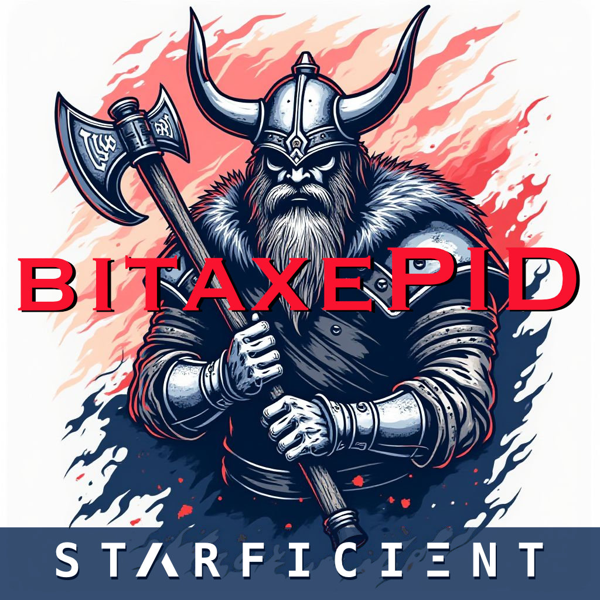
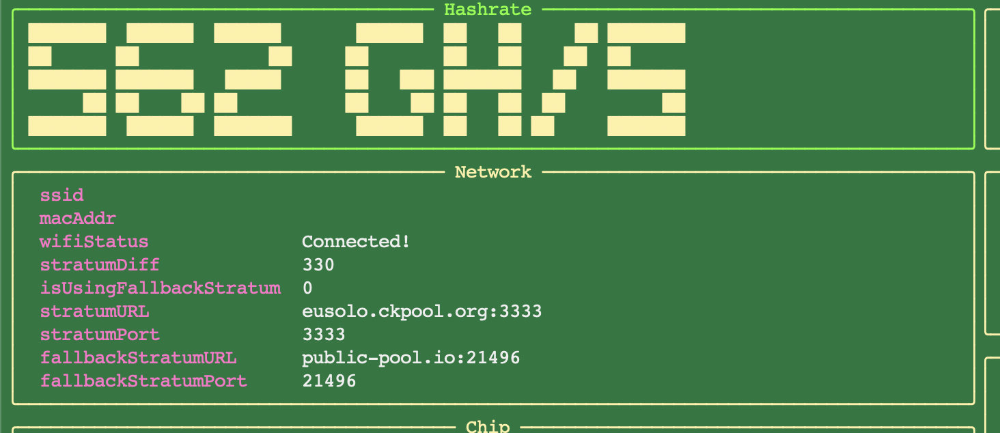
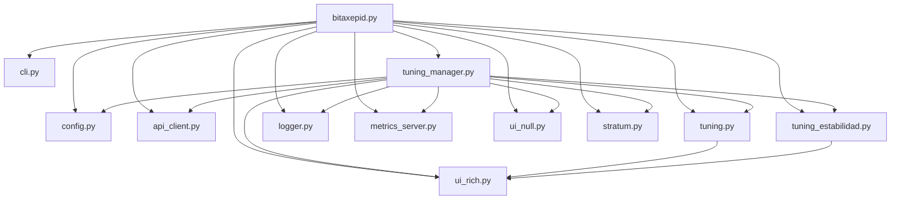

# BitaxePID Auto-Tuner



## Overview

BitaxePID is an auto-tuning utility for Bitaxe open-source Bitcoin ASIC miners
(BM1366, BM1368, BM1370 and BM1397). It adjusts core voltage and frequency to
find the fastest setting the chip sustains, keeping temperature, power and
hardware error rate within limits. It provides a cyberpunk-themed TUI for
real-time monitoring; tuning data is logged to CSV and persisted to a JSON
snapshot.

> **This fork no longer contains a PID controller.** Not one. The name is
> historical. Hashrate is not a target either — it is a *result* of voltage and
> frequency, so `HASHRATE_SETPOINT` is read by nothing and only fills a CSV
> column. Two strategies are available and `ERROR_TUNING` selects between them;
> see [Tuning strategies](#tuning-strategies). If you are looking for the
> upstream PID behaviour, this is not it.

## Quick start

If this is your first run, **[EMPEZAR.md](EMPEZAR.md)** is the complete minimal
guide, in Spanish: which files are actually required, how to check your chip is
one of the four supported, and how to validate a profile before it writes
voltage to hardware. What follows here is the condensed version.

The container path, which is the tested one. From the repository root:

```bash
cp .env.example .env      # put your miner's IP in BITAXEPID_MINER_IP
docker compose up -d --build
docker compose logs -f
```

That is all. `BITAXEPID_CONFIG` already points at
`perfiles/gamma-estabilidad.yaml`, the profile for a Bitaxe Gamma (BM1370) — if
your miner is a different chip, change it before starting. Include the
directory: profiles live in `perfiles/` and the factory limits in `chips/`. The log should say
`Estrategia de estabilidad: objetivo 2.0% de errores de hardware`; if it says
`Estrategia por limites` instead, the profile did not load.

Without containers, in a virtual environment:

```bash
bash scripts/setup.sh
bash scripts/start.sh 192.168.68.111
```

Both commands are run **from the repository root**: the tuner resolves
`pools.yaml`, the CSV and the snapshot relative to the current directory, so
running it from elsewhere writes those files elsewhere. (The scripts under
`scripts/` are the exception — they `cd` to the root themselves.)

[UMBREL.md](UMBREL.md) is the step-by-step version for an Umbrel node, in
Spanish, with a real startup log and what to check.

### Note

Upgrades may require updates to all files. You should either download the FULL
release for a version, or clone the main repo.



---

### Intent

- **Performance optimization**: adjusts voltage and frequency within the limits
  declared in the chip's YAML file, looking for the highest sustainable frequency
  and the lowest voltage that holds it.
- **Thermal and power management**: safety comes first. If temperature exceeds
  `TARGET_TEMP` or power exceeds `POWER_LIMIT * 1.075`, the tuner lowers settings
  regardless of what that costs in hashrate.
- **Stability**: decisions are made on a rolling median of the miner's hardware
  error rate, not on a single reading, because that signal is noisy.
- **Non-intrusive by default**: BitaxePID does not touch the miner's stratum
  pool configuration unless you explicitly allow it. See
  [Pool management](#pool-management).
- **User experience**: a rich TUI with ANSI-art hashrate display, system stats,
  progress bars and a scrolling log, alongside file-based logging.

### Hardware context

The Bitaxe family (values below for the Ultra/Supra class boards):

- BM1366 ASIC: 0.021 J/GH efficiency.
- Power: 5V DC, 15W max, via TI TPS40305 buck regulator and Maxim DS4432U+ DAC.
- Control: ESP32-S3-WROOM-1 for WiFi/API, with INA260 power meter and EMC2101
  for fan/temperature monitoring.
- Cooling: requires a 40x40mm fan.

## Features

- **Model-specific configuration**: one YAML per ASIC model, plus an optional
  user YAML that overrides individual keys via `--config`.
- **Two tuning strategies**: selected by `ERROR_TUNING`. See
  [Tuning strategies](#tuning-strategies).
- **Safety constraints**: respects the power limit and the voltage/frequency
  bounds of the configured chip.
- **Snapshot**: writes the last applied pair to
  `bitaxepid_snapshot_<model>.json`. Note it is **written but never read back** —
  every run starts from `INITIAL_VOLTAGE`/`INITIAL_FREQUENCY`, not from where the
  previous one stopped.
- **TUI display**: cyberpunk-style interface with ANSI-art GH/s, system stats,
  progress bars and a scrolling log. `--log-to-console` disables it.
- **Logging**: `bitaxepid_monitor.log` plus a CSV tuning log.
- **Optional metrics endpoint**: JSON over HTTP on port 8093, enabled with
  `--serve-metrics`. Note it serves plain JSON, not the Prometheus text
  exposition format, so Prometheus cannot scrape it directly; it is useful as-is
  for a browser, `curl`, or anything that reads JSON.

## Installation

Requires **Python 3.9 or newer** (the code uses builtin generics such as
`tuple[str, int]`).

Install the dependencies declared in `requirements.txt`:

```bash
pip install -r requirements.txt
```

Or create a virtual environment with [uv](https://docs.astral.sh/uv/getting-started/installation/):

```bash
bash scripts/setup.sh
```

The scripts under `scripts/` can be run from any directory; they resolve paths
relative to the repository root.

Both `scripts/setup.sh` and `scripts/start.sh` look for the virtual environment
in `.venv/bin/activate` and `.venv/Scripts/activate`, whichever exists, so the
same commands work on Linux, macOS and on Windows under Git Bash — uv creates
`Scripts/` there, not `bin/`. If neither is found, the error names both paths it
searched.

## Containers

### docker compose

The easiest way to leave the tuner running on a machine that is already on all
the time (an Umbrel node, a Raspberry Pi, a NAS):

```bash
cp .env.example .env      # put your miner IP in BITAXEPID_MINER_IP
docker compose up -d --build
docker compose logs -f
```

[UMBREL.md](UMBREL.md) walks through this on an Umbrel node step by step, in
Spanish: what the startup log should look like, how to check the limits are
actually in place, and what is verified and what is not.

`docker compose down` stops it. The default profile is
`perfiles/gamma-estabilidad.yaml` (stability strategy, see below); change
`BITAXEPID_CONFIG` in `.env` for a different one. Unsetting it is a bad idea: you
get the factory limits of whichever chip the miner reports, with `ERROR_TUNING`
undeclared and therefore the other strategy.

The tuning CSV and the snapshot are written to `./data`, which is mounted into
the container, so they survive `docker compose down`. Metrics are published on
the host port set by `BITAXEPID_METRICS_PORT` (8093 by default).

The container talks to the miner over HTTP on the LAN through the default bridge
network: it needs no extra privileges and no host networking. It also means it
cannot discover the miner by mDNS, so give the miner a fixed address — a DHCP
reservation in your router is enough.

**`.env` is for `docker compose` only.** Its three variables are interpolated by
compose into the container's `command` and `ports` — nothing in the Python code
reads the environment. Running `python bitaxepid.py` directly ignores `.env`
entirely; use `--ip`, `--config` and `--serve-metrics` instead. `smoke_test.sh`
fails if the compose file interpolates a variable that `.env.example` does not
declare, so a new variable cannot ship without its template entry.

### podman

```bash
podman build --tag bitaxepid-container .
podman run -it --publish 8093:8093 bitaxepid-container 192.168.68.111
```

Extra flags are passed through to the tuner, so
`podman run ... bitaxepid-container 192.168.68.111 --manage-pools` works.

## Safe limits

`MIN_VOLTAGE`, `MAX_VOLTAGE`, `MIN_FREQUENCY` and `MAX_FREQUENCY` are hard
limits: no value outside that range is ever sent to the miner. Both paths that
write to the hardware are clamped — the initial value (in `validate_config`,
after the command-line overrides are applied) and every proposal from the tuning
strategy (at the end of `apply_strategy`). A clamped initial value is logged as
a warning rather than being applied silently.

`TARGET_TEMP` is not a limit but a setpoint: above it, the tuner lowers
frequency first and then voltage, one step per sample.

Two ready-made profiles ship for the Bitaxe Gamma (BM1370), in `perfiles/`. Both
are passed with `--config` on top of `chips/BM1370.yaml`.

The split is the point: `chips/` holds the four factory YAML files, one per ASIC,
which you should not edit — raising a maximum there raises it for every profile
that does not declare it. `perfiles/` holds what you do edit. Each directory has
its own `LEEME.md`, in Spanish.

### `perfiles/gamma-estabilidad.yaml` — the default, and the recommended one

```bash
python bitaxepid.py --ip 192.168.68.111 --config perfiles/gamma-estabilidad.yaml
```

This is what `docker compose` loads, and the only profile tested on real
hardware. It runs the stability strategy (`ERROR_TUNING: TRUE`): 60 °C target,
1180-1210 mV, 475-925 MHz, and a 2 % hardware-error target that the tuner uses to
find the lowest voltage the chip holds.

It declares **all 32 readable keys explicitly**, inheriting nothing from
`chips/BM1370.yaml`, so one file tells you everything the run will use. The 925 MHz
ceiling is a bound, not a goal — in practice temperature stops the ramp long
before it, which is the point of having a target temperature.

[UMBREL.md](UMBREL.md) documents this profile in detail, in Spanish, with a real
log of the three states.

### `perfiles/gamma-conservador.yaml` — the conservative alternative

```bash
python bitaxepid.py --ip 192.168.68.111 --config perfiles/gamma-conservador.yaml
```

Uses the **other** strategy (`ERROR_TUNING` undeclared, so decisions come from
temperature and power only): 55 °C, 1100-1150 mV, 425-500 MHz, starting at
1100 mV / 450 MHz. Not tested on hardware. Pick it only if you have a reason to
prefer limit-based tuning; otherwise use the profile above.

Like the other one, it now declares **every key it uses** — 24 of them —
inheriting nothing. It used to declare only the two ceilings, which left the
floors at the factory 1000 mV / 400 MHz: an effective range of 1000-1150 mV in a
file called "safe". The floor is where the minimum-voltage search and the thermal
branch bottom out, and a BM1370 does not mine stably at 1000 mV. Two of the ten
keys it inherited were not inert either — `VOLTAGE_STEP` and `FREQUENCY_STEP`
decide how far the tuner moves per sample, so editing a factory YAML changed this
profile's behaviour without touching it.

`tests/test_claves_config.py` enforces this for any file in `perfiles/`, not just
these two: every profile must declare the six hard limits.

### If the profile is missing

A profile passed with `--config` must exist and must be readable: the program
exits rather than falling back to the chip defaults, because silently running
with factory limits when you believe otherwise is worse than not starting.

## Usage

Run the tuner with the Bitaxe IP address and optional arguments:

```bash
python bitaxepid.py --ip 192.168.68.111 --config custom_config.yaml --voltage 1200 --frequency 500
```

Or, with the uv virtual environment created by `scripts/setup.sh`:

```bash
bash scripts/start.sh 192.168.68.111
```

### Validating a profile without a miner

```bash
python bitaxepid.py --dry-run --asic BM1370 --config perfiles/gamma-estabilidad.yaml
```

`--dry-run` loads both YAML layers, merges and validates them, prints the
effective value of every key **together with the file it came from**, and exits
0 — without opening a single connection. An invalid configuration exits 1.

`--asic` is required here, and only here: the chip model is normally read from
the miner's `ASICModel`, and there is no miner to ask. Guessing a default would
be worse than refusing — it would validate your profile against another chip's
limits and report success.

This is the way to see the two-layer inheritance. A profile that lowers
`MAX_VOLTAGE` but leaves `MIN_VOLTAGE` undeclared keeps the factory minimum, so
its effective range is not the one its filename suggests. The same information
goes to the log at INFO on every normal start:

```text
INFO - 14 claves declaradas en perfiles/mi-perfil.yaml; 10 heredadas de chips/BM1370.yaml: FREQUENCY_STEP, PID_FREQ_KD, ...
```

Full option list:

```text
usage: bitaxepid.py [-h] [--version] [--ip IP] [--dry-run] [--asic {BM1366,BM1368,BM1370,BM1397}] [--config CONFIG]
                    [--user-file USER_FILE] [--pools-file POOLS_FILE] [--primary-stratum PRIMARY_STRATUM]
                    [--backup-stratum BACKUP_STRATUM] [--stratum-user STRATUM_USER]
                    [--fallback-stratum-user FALLBACK_STRATUM_USER] [--voltage VOLTAGE] [--frequency FREQUENCY]
                    [--sample-interval SAMPLE_INTERVAL] [--log-to-console] [--logging-level {info,debug}]
                    [--serve-metrics] [--manage-pools]

BitaxePID Auto-Tuner

options:
  -h, --help            show this help message and exit
  --version             show program's version number and exit
  --ip IP               IP address of the Bitaxe miner
  --dry-run             Cargar y validar la configuracion, imprimirla con el fichero del que sale cada clave, y
                        salir sin conectar con ningun miner. Necesita --asic, porque el modelo se lee del miner y
                        aqui no se consulta
  --asic {BM1366,BM1368,BM1370,BM1397}
                        Modelo de ASIC para --dry-run. En una ejecucion normal no se usa: el modelo lo reporta el
                        propio miner
  --config CONFIG       Path to optional user YAML configuration file
  --user-file USER_FILE
                        Path to user YAML file (default: from config)
  --pools-file POOLS_FILE
                        Path to pools YAML file (default: from config)
  --primary-stratum PRIMARY_STRATUM
                        Primary stratum URL (e.g., stratum+tcp://host:port)
  --backup-stratum BACKUP_STRATUM
                        Backup stratum URL (e.g., stratum+tcp://host:port)
  --stratum-user STRATUM_USER
                        Stratum user for primary pool
  --fallback-stratum-user FALLBACK_STRATUM_USER
                        Stratum user for backup pool
  --voltage VOLTAGE     Initial voltage override (mV)
  --frequency FREQUENCY
                        Initial frequency override (MHz)
  --sample-interval SAMPLE_INTERVAL
                        Sample interval override (seconds)
  --log-to-console      Log to console instead of UI
  --logging-level {info,debug}
                        Logging level
  --serve-metrics       Serve metrics via HTTP on port 8093 (default: False)
  --manage-pools        Permitir que BitaxePID reconfigure los pools stratum del miner y lo reinicie al arrancar
                        (default: False, no se toca la configuracion de pools existente)
```

## Pool management

By default BitaxePID **leaves the miner's stratum configuration alone**. Your
miner may be pointed at a pool you chose deliberately, and rewriting that
without being asked is intrusive. With pool management disabled the tuner reads
the miner's state, adjusts voltage and frequency, and nothing else — it does not
call `set_stratum`, does not measure pool latencies and does not rewrite
`pools.yaml`.

Enable it either per run or in the configuration file:

```bash
python bitaxepid.py --ip 192.168.68.111 --manage-pools
```

```yaml
MANAGE_MINER_POOLS: TRUE
```

Two consequences worth knowing before you enable it:

- BitaxePID measures the latency of every pool in `pools.yaml`, picks the two
  fastest, writes them to the miner and **restarts it**. Give it a couple of
  minutes to come back.
- Conversely, with pool management disabled the miner is **not** restarted at
  startup either, because the restart is part of the stratum sequence. This is
  deliberate.

Explicit endpoints (`--primary-stratum`, `PRIMARY_STRATUM` in the config) also
require `--manage-pools`: without it they are stored but never applied.

### The payout address in `user.yaml`

> **`user.yaml` ships with the fork owner's Bitcoin address.** If you clone this
> and enable pool management without editing that file, and your miner reports an
> empty `stratumUser`, you will be mining to *their* address. Nothing in the log
> says so. Edit `user.yaml` first.

The file is read only when two things hold at once: pool management is enabled,
*and* the miner reports an empty `stratumUser` over its API. Anything already
configured in AxeOS wins over the file, which is why this stays inert in most
installs — and why it is easy to miss.

It used to carry the *upstream project's* address (`bc1qx6uq…bitaxepid`) —
identical to the one in the parent repository, so neither the fork owner's nor
yours. That was the actual defect: not that an address was versioned, but that it
belonged to a third party and nothing announced it. It is now the fork owner's,
with the warning above in the file itself.

To use pool management, put **both** keys in `user.yaml` (the fallback does not
default to the primary — see the comment in the file), or set the user in AxeOS,
or pass `--stratum-user`.

## Configuration notes

Default settings come from the ASIC model YAML file in `chips/` — `BM1366.yaml`,
`BM1368.yaml`, `BM1370.yaml`, `BM1397.yaml`. The program picks one from the
`ASICModel` the miner reports and cannot be told which (`ruta_yaml_de_chip` in
`config.py`). If `--config` is provided, its keys override the model defaults. Command-line options such as `--voltage`,
`--frequency` and `--sample-interval` override both.

The following 14 keys are mandatory; the program exits if any is missing:
`INITIAL_VOLTAGE`, `INITIAL_FREQUENCY`, `SAMPLE_INTERVAL`, `LOG_FILE`,
`SNAPSHOT_FILE`, `POOLS_FILE`, `MIN_VOLTAGE`, `MAX_VOLTAGE`, `MIN_FREQUENCY`,
`MAX_FREQUENCY`, `VOLTAGE_STEP`, `FREQUENCY_STEP`, `TARGET_TEMP`, `POWER_LIMIT`.

With `ERROR_TUNING` off, seven more are required: `PID_FREQ_KP/KI/KD`,
`PID_VOLT_KP/KI/KD` and `HASHRATE_SETPOINT`. **Nothing reads them to decide
anything** — they only fill seven CSV columns, kept so a new history stays
comparable with older ones on that strategy. They are not required with
`ERROR_TUNING: TRUE`.

Everything else is optional and falls back to a default declared in one place,
`CLAVES_OPCIONALES` in `config.py`. Startup logs a warning listing every optional
key you did not declare and the value it will use instead. `ERROR_TUNING` gets a
warning of its own, because its default is `FALSE` — that is not a nuance, it is
the *other strategy*.

### Example configuration file (`chips/BM1366.yaml`)

```yaml
# chips/BM1366.yaml
INITIAL_FREQUENCY: 485       # "485 (default)" from BM1366DropdownFrequency
MIN_FREQUENCY: 400           # lowest available frequency in BM1366DropdownFrequency
MAX_FREQUENCY: 575           # highest available frequency in BM1366DropdownFrequency
INITIAL_VOLTAGE: 1200        # "1200 (default)" from BM1366CoreVoltage
MIN_VOLTAGE: 1100            # lowest available voltage in BM1366CoreVoltage
MAX_VOLTAGE: 1300            # highest available voltage in BM1366CoreVoltage
FREQUENCY_STEP: 25
VOLTAGE_STEP: 10
TARGET_TEMP: 55.0
SAMPLE_INTERVAL: 60
POWER_LIMIT: 15.0
HASHRATE_SETPOINT: 525
PID_FREQ_KP: 0.2
PID_FREQ_KI: 0.01
PID_FREQ_KD: 0.02
PID_VOLT_KP: 0.1
PID_VOLT_KI: 0.01
PID_VOLT_KD: 0.02
LOG_FILE: "bitaxepid_tuning_log_BM1366.csv"
SNAPSHOT_FILE: "bitaxepid_snapshot_BM1366.json"
POOLS_FILE: "pools.yaml"
METRICS_SERVE: false         # yaml boolean lowercase true/false
MANAGE_MINER_POOLS: FALSE    # see "Pool management" above
USER_FILE: "user.yaml"       # only used if stratumUser is blank on the Bitaxe
# PRIMARY_STRATUM: "stratum+tcp://stratum.solomining.io:7777"
# BACKUP_STRATUM: "stratum+tcp://stratum.solomining.io:7777"
```

## Tuning strategies

There is no PID controller in this fork. `ERROR_TUNING` picks one of two
rule-based strategies. Neither one targets a hashrate.

Every decision is printed with its reason (in Spanish, via `rich` on stdout), so
you can see why the tuner moved.

### `ERROR_TUNING: TRUE` — stability search (`tuning_estabilidad.py`)

The recommended one, and the only one tested on real hardware. A state machine:

1. **RAMPA** — raise voltage to `MAX_VOLTAGE`, then walk frequency up one
   `FREQUENCY_STEP` per sample until `TARGET_TEMP` stops it. That is the highest
   and most stable point available.
2. **BUSCAR_VOLTAJE** — lower voltage step by step until the hardware error rate
   reaches `ERROR_TARGET_PERCENT`, then back off one step. What remains is the
   *minimum* voltage that meets the target.
3. **OPTIMIZAR** — errors above target raise voltage; comfortable thermal margin
   raises frequency; and only with frequency already at the ceiling does it keep
   trying to lower voltage further.

Decisions use the **median** of the last `ERROR_WINDOW` samples, discarding
`ERROR_SETTLE` samples after each change. The miner's `errorPercentage` is noisy
enough that a single reading crosses any threshold in both directions.

### `ERROR_TUNING` absent or `FALSE` — limit-based (`tuning.py`)

Despite the `PIDTuningStrategy` class name, no PID. Five rules by priority:

1. Temperature above `TARGET_TEMP` → lower frequency (then voltage, if frequency
   is already at the floor).
2. Power above `POWER_LIMIT * 1.075` → lower voltage.
3. Errors above `ERROR_TARGET_PERCENT` → raise voltage.
4. Thermal margin available → raise frequency.
5. Several stable samples in a row → lower voltage, looking for the minimum.

Steps and limits live in the model YAML file; tune them there rather than in the
code.

## Architecture

Twelve flat modules, one responsibility each, no subpackages and no abstract
base class layer:

| Module | Responsibility |
| --- | --- |
| `bitaxepid.py` | Entry point: wires everything together and handles signals. |
| `cli.py` | Command-line arguments. |
| `config.py` | Loads and validates the YAML configuration. |
| `api_client.py` | HTTP client for the miner's API (`urllib3`). |
| `stratum.py` | Pool file handling, endpoint parsing and latency measurement. |
| `tuning.py` | Limit-based strategy (`ERROR_TUNING` off): decides the next voltage/frequency pair. |
| `tuning_estabilidad.py` | Stability strategy (`ERROR_TUNING: TRUE`), the default. |
| `tuning_manager.py` | The tuning loop and the startup sequence. |
| `logger.py` | CSV tuning log and JSON snapshot. |
| `metrics_server.py` | Optional HTTP metrics endpoint on port 8093. |
| `ui_rich.py` | The TUI, plus the colour theme and the shared `Console`. |
| `ui_null.py` | No-op UI used by `--log-to-console`. |

Dependencies only point one way: `bitaxepid.py` composes the objects, and the
lower modules never import it.



Startup order matters and is explicit: constructing a `TuningManager` has no
side effects, and everything that talks to the miner happens in
`connect_and_configure()`. That is what makes the manager testable without a
miner on the network.

`stratum.py` can also be run on its own to measure pools and print the result:

```bash
python stratum.py            # YAML to stdout, log to stderr
```

## Tests

Unit tests need no miner and no network:

```bash
python -m unittest discover -s tests -t .
```

`scripts/smoke_test.sh` is a broader safety net: it byte-compiles every module,
checks by AST analysis that no module uses a name it neither defines nor imports
(the failure mode of moving code between files), validates the configuration
files against the keys the code actually requires, checks `requirements.txt`
**both ways** (nothing imported is undeclared, and nothing declared goes
unimported — the `Containerfile` installs that file verbatim, so a stale entry
ships a package that never runs) and then runs the unit tests. Checks that need
third-party packages are skipped, not failed, when those packages are absent.

```bash
bash scripts/smoke_test.sh
```

On Windows, where the interpreter is `python` rather than `python3`:

```bash
PYTHON=python bash scripts/smoke_test.sh
```

## Credits

Based on concepts and code from
[Hurllz/bitaxe-temp-monitor](https://github.com/Hurllz/bitaxe-temp-monitor/).

Extensively refactored: split into single-responsibility modules, and later
rewritten to drop the PID controllers and the hashrate setpoint in favour of the
two rule-based strategies described above.

## Donations


Acepto cualquier donación, ya que realmente me está sirviendo este programa y gasté un par de sats en vibecodearlo, muchas gracias por leer hasta aqúi.

### BOLT12 OFFER:
***lno1pgqppmsrse80qf0aara4slvcjxrvu6j2rp5ftmjy4yntlsmsutpkvkt6878syu9rkvrla9j0ec7rgwvm4hkwp9049jmpsj8cesjne4negyt0ux9wqgp70pyulexvmz54jvwhr4pxwhfzlpgkr625rgmkwmc4zdhwzvf9ceqqxw0jfn0e4du6z8aejprzmavglqppt0l4mc0aztg0nud0lfja5s6f3x968z0eefmnntvwlg7nw8lekhwfcctq98jtw3thaasw7l3e4ryvluh5p6ju9dlxdtnlsfwhawe46r3gn5ddqqexgazuue69v5j42zqp688lyx9y6h5g2fghsfmeeavwrsrjm8zz3fpn2w0newtwhe8fh7st0lz6058mceqs***

### Bitcoin URI:
***bitcoin:?lno=lno1pgqppmsrse80qf0aara4slvcjxrvu6j2rp5ftmjy4yntlsmsutpkvkt6878syu9rkvrla9j0ec7rgwvm4hkwp9049jmpsj8cesjne4negyt0ux9wqgp70pyulexvmz54jvwhr4pxwhfzlpgkr625rgmkwmc4zdhwzvf9ceqqxw0jfn0e4du6z8aejprzmavglqppt0l4mc0aztg0nud0lfja5s6f3x968z0eefmnntvwlg7nw8lekhwfcctq98jtw3thaasw7l3e4ryvluh5p6ju9dlxdtnlsfwhawe46r3gn5ddqqexgazuue69v5j42zqp688lyx9y6h5g2fghsfmeeavwrsrjm8zz3fpn2w0newtwhe8fh7st0lz6058mceqs***

### Lightning Address: 
***irisnephew09@phoenixwallet.me***

### BTC Address: 
***bc1qatdwu9mrx4uq8sslhex8gsg5lk39cyxvu3y0lxplk46vxdzmgmpqjsqg93***
